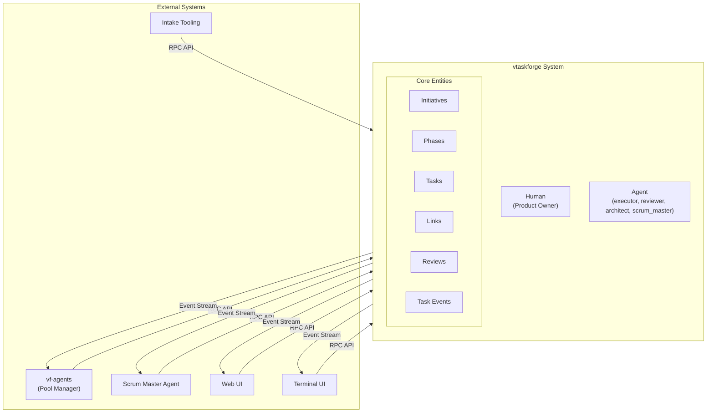
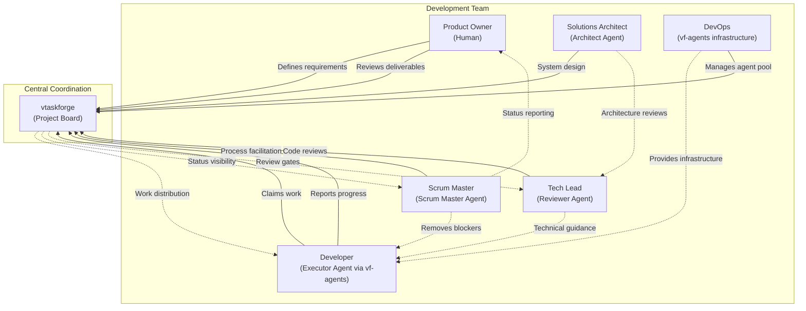
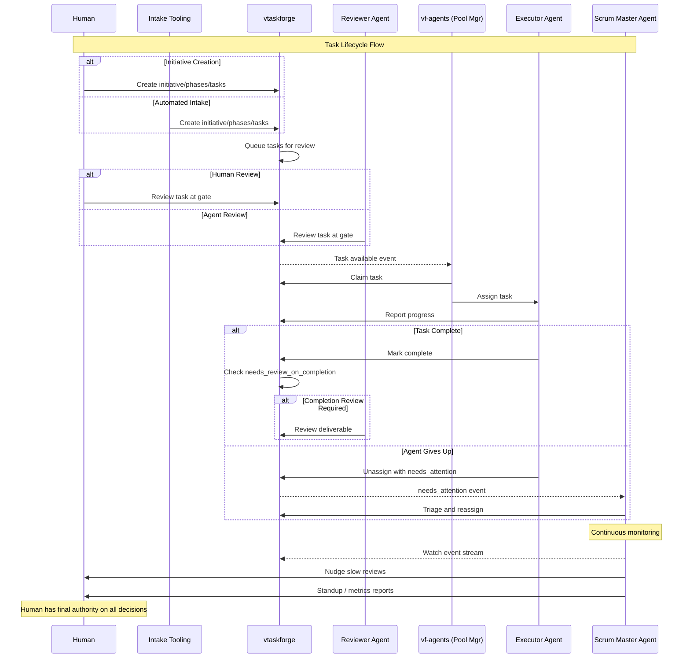

# vtaskforge — Actor Model

Status: Design (2026-03-19)

## Overview

vtaskforge models a development team where humans and AI agents collaborate on structured work. This document defines the actors, their roles, system boundaries, and interaction patterns.

## System Boundary

vtaskforge tracks two types of actors internally. All external systems interact via the RPC API and event stream.

### Internal actors (vtf knows about)

| Actor type | Identity | Role in vtf |
|---|---|---|
| **Human** | User ID, name | Creates initiatives, reviews tasks, triages, final authority |
| **Agent** | Agent ID, role label | Claims tasks, submits results, submits reviews |

Agent roles are labels, not permissions:

```
actor_id: "agent-claude-7"
actor_type: agent
actor_role: executor | reviewer | architect | scrum_master
```

### External systems (outside vtf boundary)

| System | Responsibility | Interface |
|---|---|---|
| **vf-agents** (pool manager) | Spins up executor agents, manages containers, retries, session capture | RPC API + event stream |
| **Scrum Master Agent** | Watches events, triages blockers, nudges slow reviews, generates reports | Event stream (read) + RPC API (write) |
| **Intake Tooling** | Converts plan documents into initiatives/phases/tasks | RPC API |
| **Web UI** | Human interaction — kanban board, task editing, agent chat | RPC API + event stream |
| **Terminal UI** | Human monitoring — kanban view, CLI task management | RPC API + event stream |

### Boundary diagram



## Development Team Model

The system maps directly to a real-world development team:

| Real-world role | System equivalent | What they do |
|---|---|---|
| **Product Owner** | Human | Defines initiatives, approves tasks, final say on priorities and scope |
| **Developer** | Executor Agent (via vf-agents) | Claims tasks, writes code, pushes commits, reports results |
| **Tech Lead / Senior Dev** | Reviewer Agent | Reviews task definitions (pre-start) and deliverables (post-completion) |
| **Solutions Architect** | Architect Agent | Refines tasks via chat, improves work packet quality, designs solutions |
| **Scrum Master** | Scrum Master Agent | Facilitates flow, triages blockers, monitors health, generates reports |
| **Project Board** | vtaskforge | Tracks all state, enforces rules, emits events |
| **DevOps / Workstations** | vf-agents infrastructure | Provides execution environment (containers, runtimes, credentials) |



## Actor Interaction Flow

How actors collaborate through a typical task lifecycle:



## Actor Identity in vtf

Every action in vtf is attributed to an actor. The `task_events` table records:

```
event_id: nanoid
task_id: reference
event_type: status_changed | claimed | review_submitted | ...
actor_id: "human-jason" | "agent-claude-7"
actor_type: human | agent
actor_role: owner | executor | reviewer | architect | scrum_master
timestamp: ISO 8601
data: { ... event-specific payload }
```

This enables:
- Full audit trail — who did what, when
- Role-based queries — "show all reviews by architect agents"
- Actor performance — cycle time per executor, review turnaround per reviewer

## Design Decisions

- **vtf is role-agnostic at the permission level (v1)** — any authenticated actor can perform any action. Role-based access control is a future concern.
- **Roles are descriptive, not prescriptive** — the `actor_role` field describes what the actor is doing in context, not what it's allowed to do.
- **vtf doesn't manage agent lifecycle** — it doesn't start, stop, or health-check agents. That's vf-agents' job. vtf just records what agents do.
- **Human is always in the loop** — the system is designed so humans can intervene at any point. No fully autonomous end-to-end execution without human visibility.
