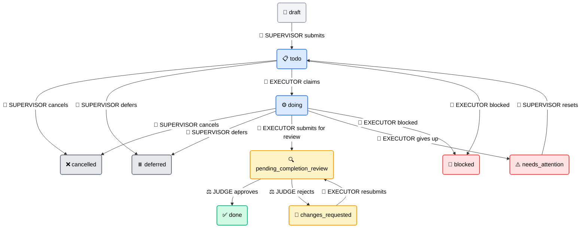
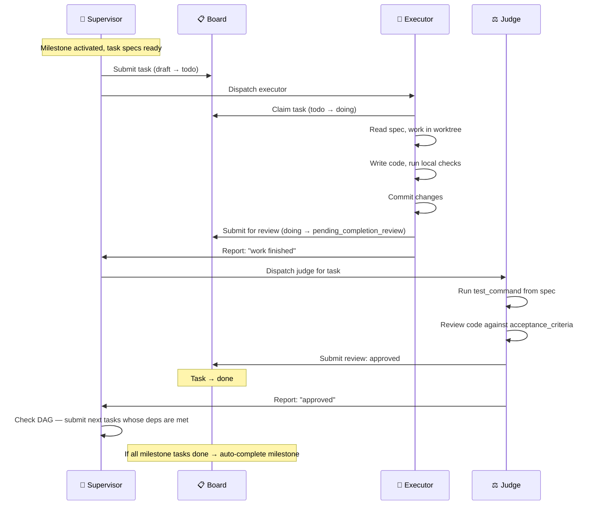
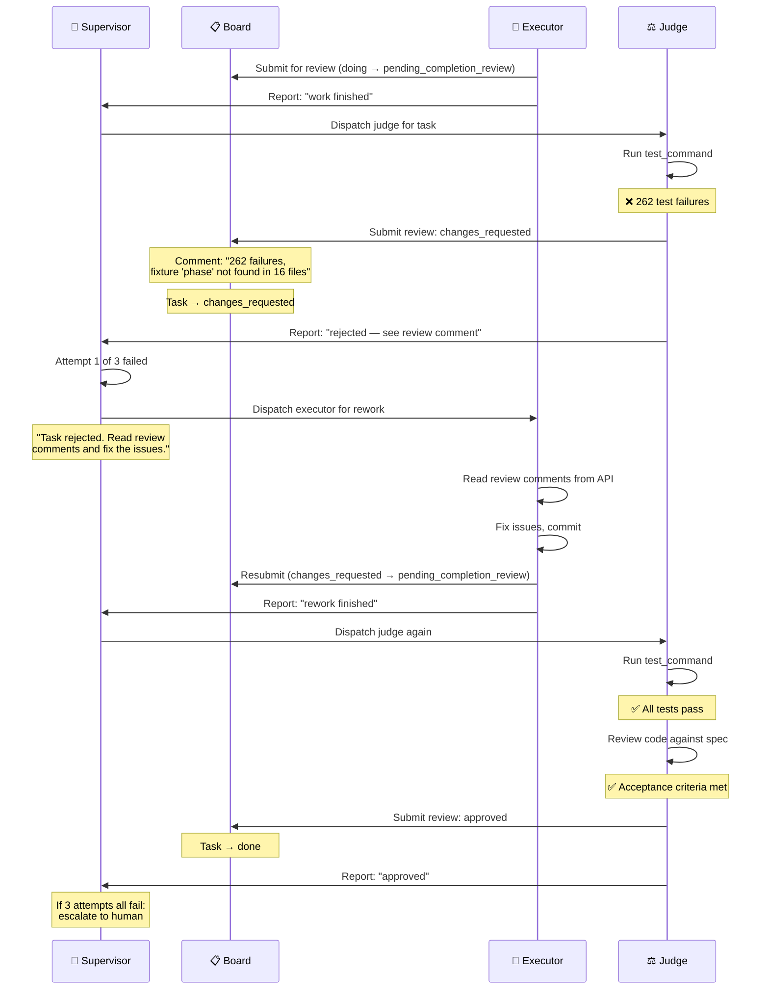
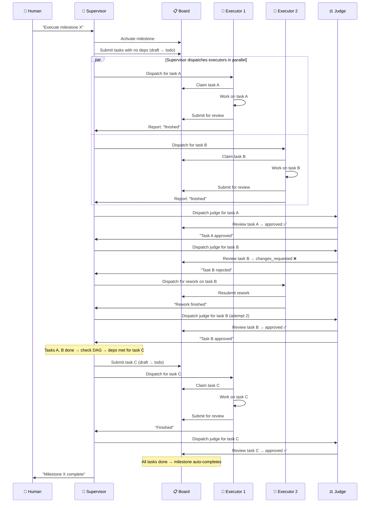

# Agent Execution Process Design

## Status: Living document (updated 2026-03-21)
## Date: 2026-03-21

## Context

This document defines how tasks flow through vtaskforge with three actor types:
Supervisor, Executor, and Judge. The process was discovered through dogfooding —
executing Phase 8 (rename) with real agents and learning from what went wrong.

**Current state:** We simulate the process manually. Claude Code subagents play
executors, the vtf-judge agent definition exists, and the human+AI session acts
as supervisor. There is no vf-agents system yet.

**Future state:** vf-agents will encode this process in code — the supervisor's
control loop, the executor's boundaries, the judge's verification, and the
reject/rework cycle will all be automated.

## Three Actors, Three Responsibilities

| Actor | Role | Board Operations | Analogy |
|-------|------|-----------------|---------|
| **Supervisor** | Orchestrate work, manage milestones, handle escalations | Submit (draft→todo), cancel, defer, unblock | Engineering Manager |
| **Executor** | Write code, implement specs | Claim (todo→doing), complete (doing→pending_completion_review) | Developer |
| **Judge** | Verify quality, enforce standards | Submit review (approved→done or changes_requested) | Code Reviewer |

Each actor owns only their natural transitions. No actor does another's job.

## Diagram 1: Task Lifecycle — Who Owns Each Transition



## Diagram 2: Happy Path — Task Succeeds First Try



## Diagram 3: Reject/Rework Loop — Task Needs Fixes



## Diagram 4: Supervisor Orchestration — Full Milestone Execution



## Quality Gates

Every task passes through up to three gates before reaching `done`:

| Gate | Who | What | When |
|------|-----|------|------|
| **test_command** | Judge | Run the automated test suite from the task spec | Always |
| **Spec review** | Judge | Compare implementation against acceptance_criteria | Always |
| **Human review** | Human | Visual verification, UX judgment, architectural decisions | Verification gates only (e.g., task 8.7) |

The judge combines gates 1 and 2. Gate 3 only applies to special verification
tasks at the end of a milestone.

## Escalation Paths

| Situation | Who detects | Action |
|-----------|-------------|--------|
| Executor can't complete task | Executor | Transition to `needs_attention`, supervisor reassigns |
| Task blocked by dependency | Executor | Transition to `blocked`, supervisor resolves |
| Judge rejects 3 times | Judge/Supervisor | Supervisor escalates to human |
| Executor claim expires | Supervisor (via Celery) | Auto-unclaim, task returns to `todo` |
| All tasks done in milestone | System (auto-completion) | Milestone → `completed` |

## How We Simulate This Today

Since vf-agents doesn't exist yet, we simulate the process manually:

| vf-agents role | Current simulation |
|----------------|-------------------|
| Supervisor agent | Human + Claude Code session (me) |
| Executor agent | Claude Code subagent (Agent tool with worktree isolation) |
| Judge agent | Claude Code vtf-judge agent (or manual verification) |
| Board | vtaskforge dogfood instance at localhost:8001 |
| Task specs | YAML files in phases/ directory, imported via vtf CLI |

### What the executor subagent receives

```
Prompt: "Execute vtf task <ID>"
- Claim the task (todo → doing)
- Read the spec (vtf task show <ID> --json)
- Do the work in the worktree
- Commit changes
- Transition to pending_completion_review
- Report back what was done
```

### What the supervisor (me) does

```
1. Activate milestone, submit tasks respecting DAG deps
2. Dispatch executor subagents for todo tasks
3. When executor reports "finished" → dispatch judge subagent
4. Judge runs test_command + reviews against spec
5. Judge submits formal review via API (approved or changes_requested with comment)
6. If rejected → dispatch executor again with "read the review comments"
7. If approved → check DAG, submit next tasks whose deps are met
8. Track retry count — escalate to human after 3 failures
9. When all tasks done → verify milestone auto-completed
```

The supervisor NEVER runs tests or reviews code directly. It dispatches
and monitors. The judge does all verification.

## Lessons from Phase 8 (2026-03-21)

These findings directly inform the vf-agents architecture:

1. **Agents cannot self-report completion.** Task 8.2 declared success with 262
   test failures. The judge gate is mandatory, not optional.

2. **Board operations must match actor roles.** Executor claims and submits for
   review. Judge approves or rejects. Supervisor orchestrates. When we mixed
   these up (executor completing, supervisor fixing code), the process broke.

3. **Reject with feedback, never fix directly.** The supervisor fixed broken
   agent work instead of rejecting it back. This doesn't scale and leaves no
   audit trail.

4. **Atomic operations need atomic execution.** Splitting a rename across 4
   parallel agents created merge conflicts. One agent per atomic change.

5. **Task boundaries should minimize file overlap.** Split by module (workplans
   app, tasks app) not by layer (backend, tests, CLI) when files are shared.

6. **Numerical verification over visual.** Use getBoundingClientRect(), test
   counts, grep counts — never eyeball screenshots.

## What vf-agents Must Encode

When we build the agent pool manager, it must implement:

1. **Supervisor control loop** — activate milestones, submit tasks respecting
   DAG deps, monitor progress, handle escalations
2. **Executor boundaries** — can claim and submit for review, cannot mark done
3. **Judge automation** — watches pending_completion_review queue, runs
   test_command, reviews against spec, submits formal review
4. **Reject/rework cycle** — changes_requested with actionable feedback,
   executor picks up rework, max 3 retries before escalation
5. **Deploy agent** — Docker builds, migrations, dogfood restarts (currently
   manual)
6. **Smoke-test agent** — Playwright verification with numerical checks
   (currently manual)
7. **Spec writer agent** — reads design docs, produces YAML task specs
   (currently human+AI collaborative)
