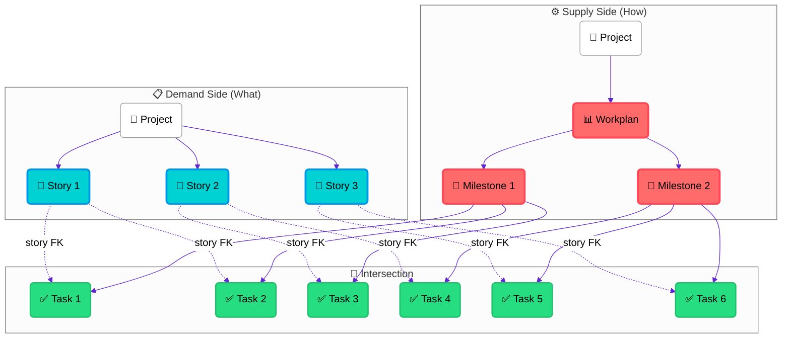
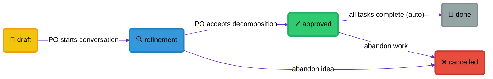
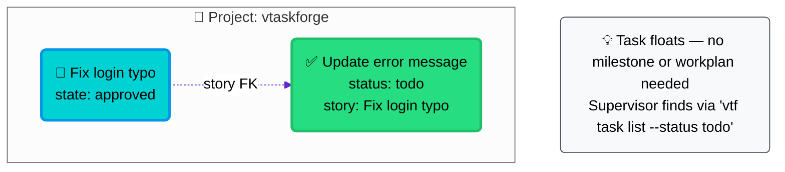
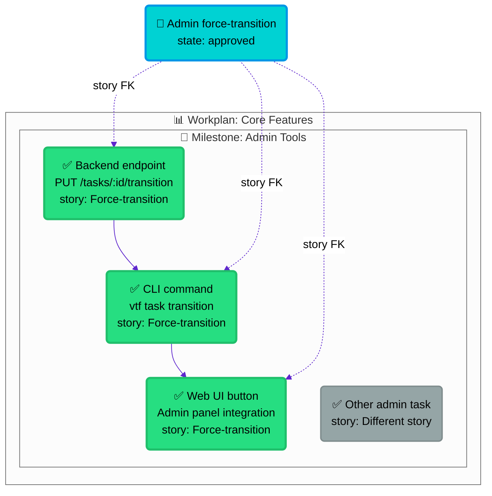
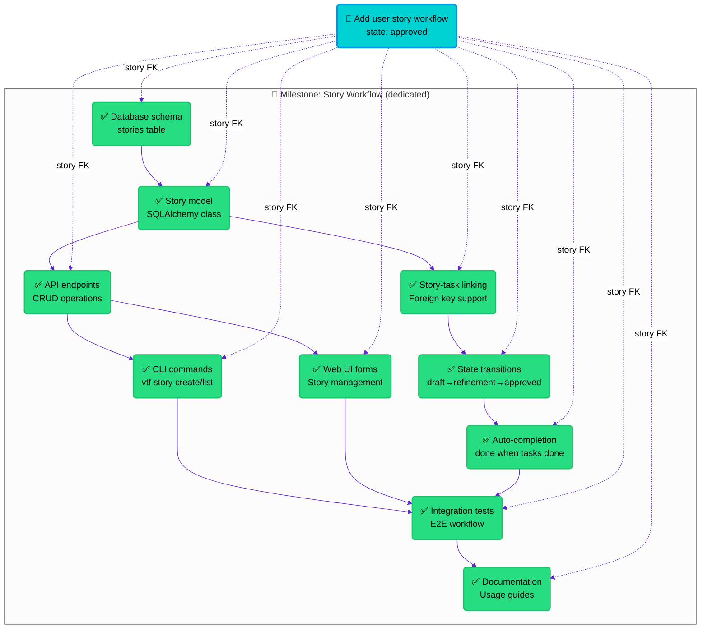
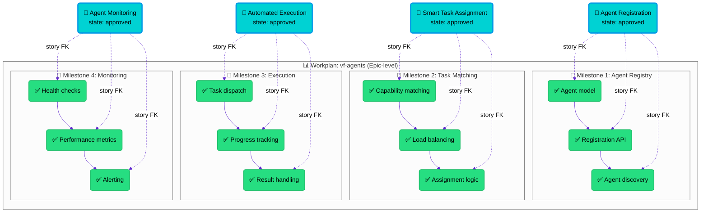

# Story-Task Relationships Design

This document explains how User Stories relate to Tasks, Milestones, and Workplans in vtaskforge, with detailed diagrams for different scenarios.

## Overview: Dual Hierarchy

vtaskforge operates with two parallel organizational views:
- **Demand Side**: What the Product Owner wants (Stories)
- **Supply Side**: How work gets organized for execution (Tasks → Milestones → Workplans)



## Story State Machine

Stories flow through a defined lifecycle from idea to completion:



**State Descriptions:**
- **draft**: Initial idea captured by PO
- **refinement**: PO and architect discussing scope and decomposition
- **approved**: PO accepted the task breakdown, work can begin
- **done**: All linked tasks completed (automatic transition)
- **cancelled**: Abandoned (cascades cancel to linked non-terminal tasks)

## Scenario 1: Tiny (1 Task, No Organization)

**Example**: "Fix typo in login error message"

Simple fixes that don't need organizational structure. The task floats independently.



## Scenario 2: Small (Multiple Tasks, Existing Milestone)

**Example**: "Admin can force-transition tasks with audit trail"

Multiple related tasks that fit into existing organizational structure.



**Key Point**: The story and milestone are parallel views. The story groups tasks by demand (what PO wants), while the milestone groups tasks by execution order.

## Scenario 3: Medium (Dedicated Milestone)

**Example**: "Add user story workflow to vtaskforge"

Complex features that need their own execution organization with dependencies.



**Characteristics**:
- Story ≈ one milestone's worth of work
- Complex DAG dependencies between tasks
- Dedicated milestone for execution ordering
- ~10-15 tasks typical for this scenario

## Scenario 4: Large (Multiple Stories, One Workplan)

**Example**: "Build vf-agents" → Architect splits into 4 focused stories

When the original request is too big, the architect breaks it into multiple stories during refinement.



**Process**:
1. PO creates "Build vf-agents" story (draft)
2. During refinement, architect says "too big" and proposes 4 stories
3. Original story gets replaced by 4 focused stories
4. Each story ≈ one milestone of work
5. Workplan provides epic-level tracking
6. Each story completes independently when its tasks are done

## Scaling Decision Rules

The architect uses these rules during story refinement to determine appropriate scope:

| Story Size | Task Count | Organization | Decision Factors |
|------------|------------|-------------|------------------|
| **Tiny** | 1 task | No milestone/workplan | Simple fix, single file change, < 1 hour |
| **Small** | 2-5 tasks | Existing milestone | Related changes, can fit in current sprint |
| **Medium** | 5-15 tasks | Dedicated milestone | Complex feature, needs DAG dependencies |
| **Large** | 15+ tasks | Split into multiple stories | Too big for one story, architect breaks down |

## Story Completion Logic

Stories automatically transition to `done` when all linked tasks reach `done` status:

```sql
-- Auto-transition logic
UPDATE stories
SET state = 'done', completed_at = NOW()
WHERE state = 'approved'
  AND NOT EXISTS (
    SELECT 1 FROM tasks
    WHERE tasks.story = stories.id
      AND tasks.status != 'done'
  );
```

## Key Design Principles

1. **Orthogonal Views**: Stories (demand) and milestones (supply) are independent organizational views
2. **Flexible Linking**: Tasks can exist without stories, stories without milestones
3. **Automatic Completion**: Story state updates automatically based on task completion
4. **Scaling Boundaries**: Clear rules for when to split stories vs. create milestones
5. **Epic-Level Tracking**: Workplans provide portfolio-level visibility for large initiatives

## Implementation Notes

- `task.story` is a nullable foreign key to `stories.id`
- Story state machine enforces proper workflow
- Cancelled stories cascade cancel to linked non-terminal tasks
- Story completion is computed, not manually set
- PO owns stories, architect owns task decomposition and organization