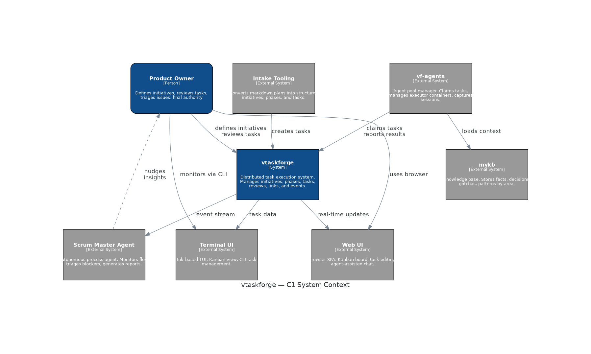
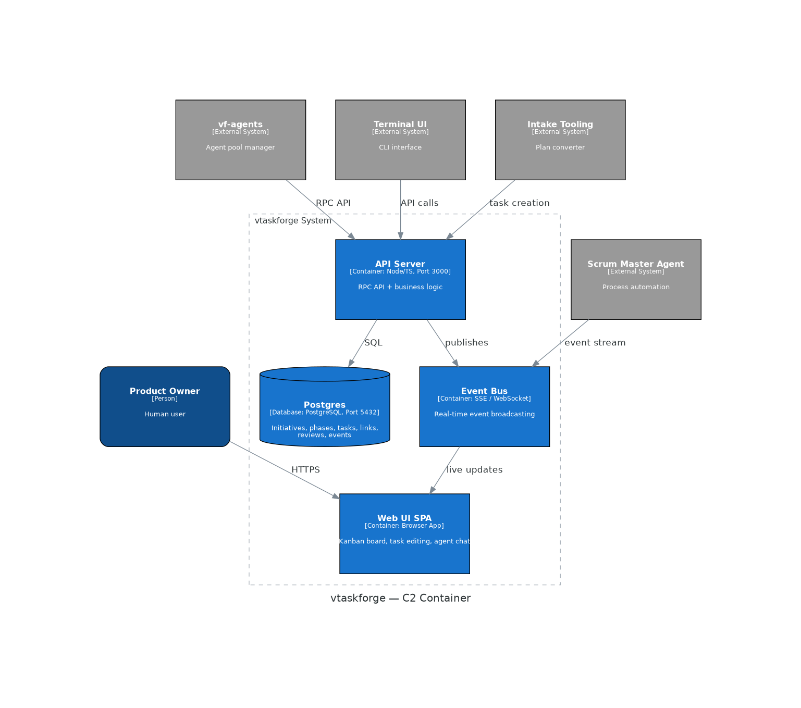
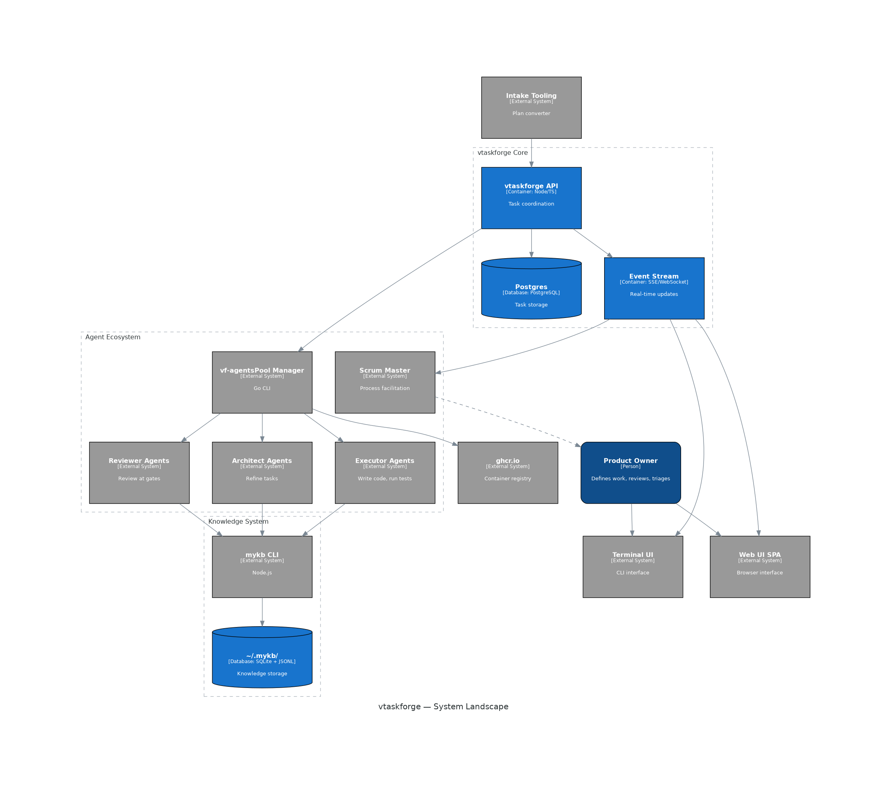
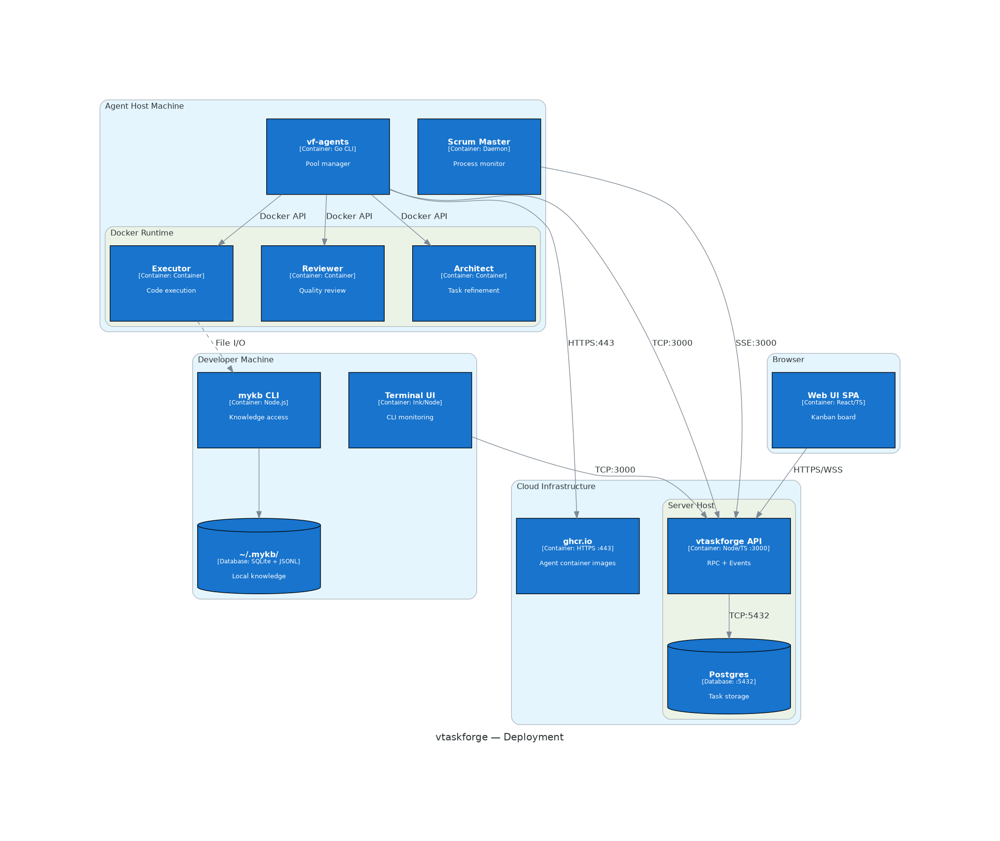

# vtaskforge — C4 Diagrams

Architecture diagrams generated using the [Python diagrams](https://diagrams.mingrammer.com/) library with C4 model support.

## Diagrams

### C1 — System Context

Bird's eye view of vtaskforge and all surrounding actors and systems.



### C2 — Container (vtaskforge internals)

Zoom into vtaskforge showing API Server, Postgres, Event Bus, and Web UI SPA.



### System Landscape

Full ecosystem — vtaskforge, vf-agents, mykb, all agent types, UIs, and supporting tools.



### Deployment

Infrastructure layout — what runs where, with ports and protocols.



## Regenerating

Prerequisites:

```bash
pip install diagrams
sudo apt-get install graphviz  # system dependency
```

Generate all diagrams:

```bash
python docs/diagrams/generate-c4-diagrams.py
```

Output PNGs are written to this directory (`docs/diagrams/`).

## Mermaid vs Python Diagrams

This project uses both diagram formats:

| Format | Location | Best for |
|--------|----------|----------|
| **Mermaid** | Inline in `actor-model-DESIGN.md` | GitHub rendering, quick edits, sequence diagrams |
| **Python Diagrams** | This directory (PNGs) | Presentations, wikis, formal C4 semantics |

Source code: [generate-c4-diagrams.py](generate-c4-diagrams.py)
